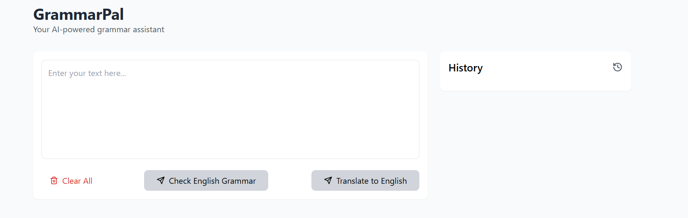

# Llama Translation and Grammar Checker Web App

A web application that leverages the Llama Large Language model to translate text from Spanish to English, and check grammar, spelling, and style.

## Features

* Translate text from Spanish to English using the Llama Large Language model
* Check grammar, spelling, and style of the translated text
* Store conversations in local storage for easy reference
* Clear all conversation history with a single button click

## How it Works

1. Enter text in Spanish in the input field
2. Click the "Translate" button to translate the text to English using the Llama model
3. The translated text will be displayed below, along with grammar, spelling, and style suggestions
4. Click the "Check Grammar and Style" button to review the suggestions
5. Conversations are stored in local storage, so you can easily refer back to previous translations
6. Click the "Clear All" button to clear the conversation history

## Technical Details

* Built using [insert technologies used, e.g. HTML, CSS, JavaScript, etc.]
* Leverages the Llama Large Language model for text translation and grammar checking
* Stores conversations in local storage using [insert storage method, e.g. localStorage API, etc.]

## Screenshots

## Live Demo

Try out the app live at: [https://valiantsin2021.github.io/ai-grammar-check](https://valiantsin2021.github.io/ai-grammar-check)

## Getting Started

1. Clone the repository to your local machine
2. Open the `index.html` file in a web browser to access the app
3. Start translating and checking grammar and style!

## Notes

* This app is for demonstration purposes only and may not be suitable for production use
* The Llama model is a large language model, and as such, may have limitations and biases
* Please use this app responsibly and in accordance with the terms of service for the Llama model